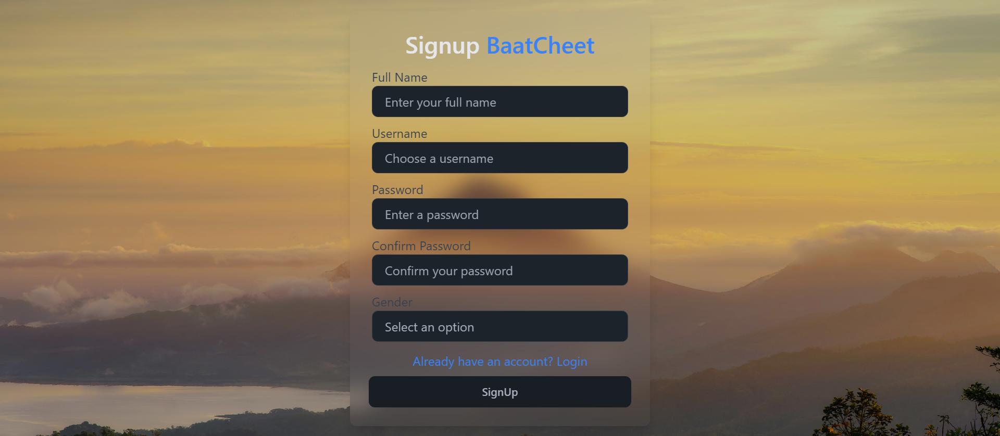
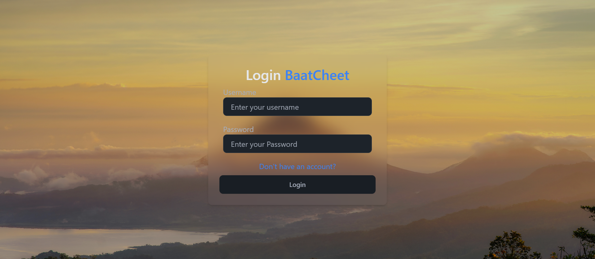
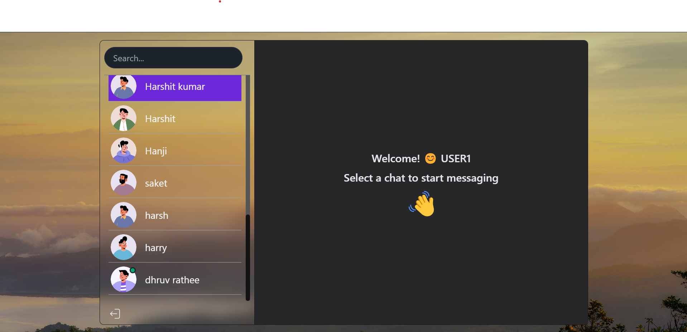

# ChatApp using MERN Stack

This project is a real-time chat application built using the MERN (MongoDB, Express.js, React.js, Node.js) stack. It allows users to create accounts, join chat rooms, and exchange messages in real-time.

## Features

- **Authentication**: Users can sign up, log in, and log out securely.
- **Real-time Messaging**: Messages update instantly for all users in a chat room.
- **Responsive UI**: The application is designed to work seamlessly across desktop and mobile devices.

## Technologies Used

- **Frontend**: React.js, Socket.io-client for real-time messaging
- **Backend**: Node.js, Express.js, Socket.io for real-time messaging
- **Database**: MongoDB Atlas for storing user data and chat messages
- **Deployment**: Deployed on Render for hosting the application and MongoDB Atlas for database hosting

Deployment
The application is deployed on Render. You can access it at [https://baat-cheet-424l.onrender.com/](https://baat-cheet-424l.onrender.com/)
